  <picture>
    <source media="(prefers-color-scheme: dark)" srcset="./assets/dark.svg">
    <source media="(prefers-color-scheme: light)" srcset="./assets/light.svg">
    
  </picture>

# 💫 About Me:
Computer Science student specializing in Bioscience, passionate about AI, Machine Learning, Deep Learning, and Computer Vision, focused on building real-world intelligent systems.  🔭 I’m currently working on  AI-powered systems including Smart Surveillance, Computer Vision models, and real-time ML applications using YOLO, TensorFlow, and OpenCV.  👯 I’m looking to collaborate on  AI/ML projects, Computer Vision, Deep Learning research, health-tech, and open-source AI tools.  🤝 I’m looking for help with  Advanced model optimization, deployment of ML models, and scaling AI systems for production.  🌱 I’m currently learning  Deep Learning architectures, Neural Networks, YOLO custom training, React-based AI dashboards, and AI applications in bioscience.  💬 Ask me about  Python, Machine Learning, Deep Learning, YOLO, OpenCV, TensorFlow, AI project building, React, and real-time AI systems.  ⚡ Fun fact  I love turning complex AI concepts into real, working systems — from surveillance to emotion recognition 🚀

## 🌐 Socials:
  

# 💻 Tech Stack:
                               

# 📊 GitHub Stats:
 
 

## 🏆 GitHub Trophies

### ✍️ Random Dev Quote

---

<!-- Proudly created with GPRM ( https://gprm.itsvg.in ) -->
